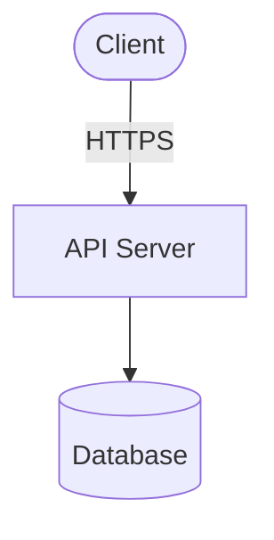
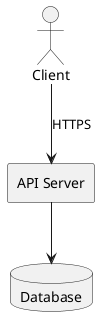

# Architecture Diagram Generator

Professional architecture diagram generation for system design. Built for architects and senior engineers who need to create, document, and share system architectures.

## Features

### Core Capabilities

- **Multiple Layout Algorithms**: Hierarchical, Force-Directed, Circular, Grid, Layered, and Tree layouts
- **Cloud Service Icons**: Built-in support for AWS, GCP, and Azure services
- **Export Formats**: SVG, Mermaid, PlantUML, and JSON
- **Pre-built Templates**: 7 production-ready architecture templates
- **Validation & Analysis**: Automatic diagram validation, complexity analysis, and cycle detection
- **Auto-Documentation**: Generate markdown documentation from diagrams

### Layout Algorithms

1. **Hierarchical** - Best for layered architectures (default)
2. **Force-Directed** - Organic layout based on physics simulation
3. **Circular** - Components arranged in a circle
4. **Grid** - Simple grid arrangement
5. **Layered** - Explicit layer-based positioning
6. **Tree** - Hierarchical tree structure

### Component Types

- **Infrastructure**: server, database, container, vm, storage
- **Services**: api, function, queue, cache, cdn, dns
- **Network**: load-balancer, firewall, gateway
- **Users**: user, external-service
- **Cloud**: cloud-service (with provider-specific icons)

### Connection Types

- **Protocols**: http, https, tcp, udp, grpc, websocket
- **Data**: database, message-queue, sync, async
- **Custom**: Flexible custom connection types

## Usage

### Basic Example

```json
{
  "action": "generate",
  "format": "all",
  "generateSummary": true,
  "config": {
    "title": "My Architecture",
    "description": "System architecture diagram",
    "layout": "hierarchical",
    "style": "modern",
    "theme": "light",
    "legend": true,
    "components": [
      {
        "id": "frontend",
        "type": "user",
        "label": "Frontend App",
        "layer": 0
      },
      {
        "id": "api",
        "type": "api",
        "label": "API Server",
        "layer": 1
      },
      {
        "id": "db",
        "type": "database",
        "label": "PostgreSQL",
        "layer": 2
      }
    ],
    "connections": [
      {
        "id": "c1",
        "from": "frontend",
        "to": "api",
        "type": "https",
        "label": "REST API"
      },
      {
        "id": "c2",
        "from": "api",
        "to": "db",
        "type": "database"
      }
    ]
  }
}
```

### Load Templates

```json
{
  "action": "list-templates"
}
```

Returns list of available templates:

- `microservices` - Modern microservices architecture
- `serverless` - Event-driven serverless architecture
- `monolith` - Traditional three-tier application
- `event-driven` - Event-driven architecture with message brokers
- `hybrid-cloud` - Hybrid cloud spanning on-premise and cloud
- `container-orchestration` - Kubernetes-based architecture
- `simple` - Basic three-tier web application

### Load a Template

```json
{
  "action": "load-template",
  "templateId": "microservices"
}
```

### Cloud Service Icons

```json
{
  "components": [
    {
      "id": "lambda",
      "type": "function",
      "label": "Lambda Function",
      "cloudProvider": "aws",
      "cloudService": "lambda"
    },
    {
      "id": "s3",
      "type": "storage",
      "label": "S3 Bucket",
      "cloudProvider": "aws",
      "cloudService": "s3"
    }
  ]
}
```

Supported cloud services:

- **AWS**: ec2, s3, rds, lambda, api-gateway
- **GCP**: compute-engine, cloud-storage, cloud-sql, cloud-functions
- **Azure**: virtual-machines, blob-storage, sql-database, functions

### Advanced Features

#### Bidirectional Connections

```json
{
  "connections": [
    {
      "id": "c1",
      "from": "serviceA",
      "to": "serviceB",
      "type": "sync",
      "label": "Data Sync",
      "bidirectional": true
    }
  ]
}
```

#### Connection Metadata

```json
{
  "connections": [
    {
      "id": "c1",
      "from": "client",
      "to": "server",
      "type": "https",
      "protocol": "HTTP/2",
      "port": 443,
      "latency": "50ms",
      "throughput": "1Gbps"
    }
  ]
}
```

#### Layers and Organization

```json
{
  "config": {
    "layers": [
      {
        "id": "presentation",
        "name": "Presentation Layer",
        "description": "User-facing components",
        "visible": true,
        "order": 0,
        "color": "#4A90E2"
      }
    ],
    "components": [
      {
        "id": "web",
        "type": "server",
        "label": "Web Server",
        "layer": 0,
        "tags": ["public", "dmz"]
      }
    ]
  }
}
```

#### Annotations

```json
{
  "config": {
    "annotations": [
      {
        "id": "note1",
        "text": "High availability setup",
        "position": { "x": 100, "y": 100 },
        "type": "callout"
      }
    ]
  }
}
```

## Output Formats

### SVG

- High-quality vector graphics
- Inline display in web browsers
- Downloadable for presentations

### Mermaid



### PlantUML



### JSON

Complete diagram configuration with layout information and metadata.

## Validation

The tool automatically validates diagrams and provides:

- **Errors**: Critical issues that prevent diagram generation
  - Missing required fields
  - Invalid component references
  - Duplicate IDs

- **Warnings**: Non-critical issues
  - Disconnected components
  - Circular dependencies
  - Missing labels
  - Incomplete cloud service configuration

- **Metadata**:
  - Component and connection counts
  - Complexity rating (low/medium/high)
  - Layer information
  - Detected issues

## Best Practices

1. **Use Layers**: Organize components in logical layers (0 = top)
2. **Meaningful Labels**: Use clear, descriptive labels
3. **Connection Types**: Choose appropriate connection types
4. **Cloud Services**: Specify cloud provider and service for accurate icons
5. **Complexity**: Keep diagrams focused (under 30 components for clarity)
6. **Templates**: Start with a template and customize
7. **Validation**: Review warnings to improve diagram quality

## Example: Microservices Architecture

See the `microservices` template for a complete example featuring:

- API Gateway pattern
- Multiple microservices
- Shared cache and message queue
- Service-specific databases
- Proper layering and connection types

## Tips for Power Users

1. **Keyboard Shortcuts**: Use ⌘K to clear input quickly
2. **Template Customization**: Load a template, then modify components
3. **Export All Formats**: Set `"format": "all"` to get SVG, Mermaid, PlantUML, and JSON
4. **Generate Documentation**: Set `"generateSummary": true` for auto-generated markdown docs
5. **Iterate Quickly**: The tool auto-processes on input change (500ms debounce)
6. **Dark Mode**: Set `"theme": "dark"` for dark-themed diagrams

## Architecture

The tool is built with a modular architecture:

- **types.ts**: TypeScript type definitions
- **icons.ts**: SVG icon library for components and cloud services
- **layouts.ts**: Layout algorithm implementations
- **templates.ts**: Pre-built architecture templates
- **generators.ts**: Output format generators (SVG, Mermaid, PlantUML)
- **validation.ts**: Diagram validation and analysis
- **index.ts**: Main processor and API

All processing is done client-side for maximum privacy and performance.
